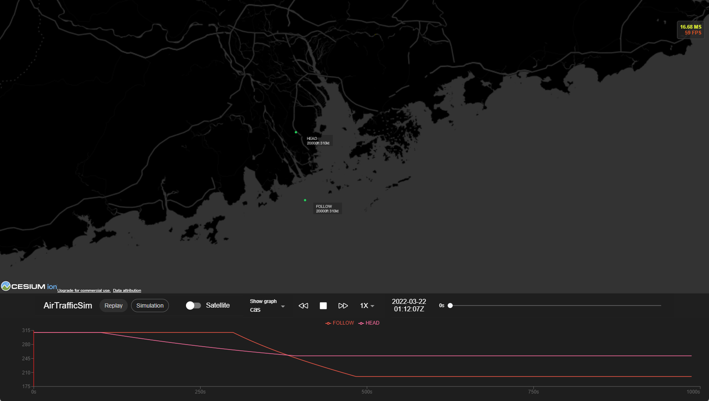

# AirTrafficSim

AirTrafficSim is a web-based air traffic simulation and visualization platform written in python and javascript. Its goal is to provide an all-in-one platform to conduct air traffic management (ATM) research as well as to enable an easy-to-access UI for user to study the result. AirTrafficSim provides aircraft performance model (BADA, OpenAP), navigation data (x-plane), weather data (ECMWF ERA5), and autopilot and flight management algorithm to enable realistic ATM simulation.

## Features

- Replay histortic flights given data (FlightRadar 24 and simulated flights)
- Air traffic simulation using [BADA performance data](https://www.eurocontrol.int/model/bada) and OpenAP (WIP)
- Autopilot and Flight Management System simulation
- Navigation data simulation and visualization from [x-plane 11](https://developer.x-plane.com/docs/data-development-documentation/)
- Weather data from [ECMWF ERA5](https://cds.climate.copernicus.eu/cdsapp#!/dataset/reanalysis-era5-pressure-levels?tab=overview) (WIP)
- Air traffic is controlled with interface to simulate ATC interaction



## Installation

Conda environment is suggested for the installation of AirTrafficSim. All dependencies will be installated automatically with the installation script. The client code has been pre-built and is ready for use after download.

### Dependencies:

- conda (tested with 4.10.3)
  - python (tested with 3.10.0)
  - numpy (tested with 1.21.2)
  - pandas (tested with 1.4.1)
  - Flask
  - Flask-SocketIO
  - Eventlet
  - cdsapi [installation guide](https://cds.climate.copernicus.eu/api-how-to)

### Install from Github

```
conda create -n AirTrafficSim python
conda activate AirTrafficSim
conda install numpy pandas
pip install Flask flask-socketio eventlet
git clone https://github.com/HKUST-OCTAD-LAB/AirTrafficSim.git
```

After installation, please also download, unzip, and store BADA data in [data/BADA](data/BADA/). In addition follow [this guide](https://cds.climate.copernicus.eu/api-how-to) to setup the API key for ECMWF Climate Data Store.


## Running AirTrafficSim

You can start the production environment by executing the following command. It uses port 5000 for communicaiton. Please open or forward the port accordingly if needed.

```
cd AirTrafficSim
python simulation run
```

You should be able to open the UI using any modern browser at http://localhost:5000.

To create a simulation environment, create a new file under [simulation/env](simulation/env/) with the name of the simulation. Then, create a subclass of `environment` in the file. You may refer to [DenoEnv.py](simulation/env/DemoEnv.py) as an example. Please note that the file name should be **exactly equal** to the class name including the capitals as it is used for the UI to select and refer the simulation environment.

Aircraft class in [aircraft.py](simulation/traffic/aircraft.py) represents an individual aircraft in traffic array and provides an interface to command the aircraft movement by simulating ATC. To control the aircraft, please write the algorithms in the override method `def atc_command(self):` in the `environment` subclass. You may refer to [DenoEnv.py](simulation/env/DemoEnv.py) as an example.

After setting up the environment and ATM algorithms, you may run the simulation by clicking the simulation buttom in the UI and selecting the simulation environment. Then, it will automatically execute `def run(self):` in `Environment` super class to run the simulation as specified. The data will be saved and visualized after the simulation.

### Running AirTrafficSim without UI

To run the simulation without the UI, you can execute the following command. 

```
cd AirTrafficSim
python simulation run --headless <enviornment name>
```

This will run the simulation without the UI by executing [\_\_main\_\_.py](simulation/__main__.py). The output data will be stored in [data/simulation](data/simulation/) as a CSV file.

## UI development

To develop the UI, nodejs (tested with 16.13.0) and yarn is needed. Currently, the client uses port 3000 and the server uses port 5000 for communication. Please open or forward the ports accordingly if needed. 

To install the development environment: 

```
cd AirTrafficSim/client/
yarn
```

Please also extract a Cesium access token from  [Cesium ion portal](https://cesium.com/platform/cesium-ion/) after signing up a free account and copy it into a new file `.env` in `client/` as follow:
>REACT_APP_CESIUMION_ACCESS_TOKEN=

To run the UI development environment:

```
cd AirTrafficSim/client/
yarn start
```

Open a new terminal windows and run a server instance:

```
cd AirTrafficSim/
python simulation run
```

You should be able to open the UI using any modern browser at http://localhost:3000.

To build the UI after development:

```
cd AirTrafficSim/client/
yarn build
```

## Contribution

AirTrafficSim is under heavy development. To contribute to the simulation, please follow this [python styling guide](https://hackmd.io/@ChrisNguyenAE/By-NM-x6t).

---

## Project structure

### client/

The client folder contains the UI of the website. It is written in react.js with [Ionic Framework](https://ionicframework.com/). It contains a 3D map using [Cesium.js + Cesium ion](https://cesium.com/) and [Resium](https://resium.reearth.io/). It also contains graph plotting using [Recharts](https://recharts.org/en-US/).

### data/

The data folder contrains all the data needed for simulation.

- [x] BADA aircraft Performance data (Not included but obtainable at [eurocontrol](https://www.eurocontrol.int/model/bada) website.)
- [x] Navigation data at [xplane_default_data.zip](data/nav/xplane_default_data.zip) using [Xplane-11 data](https://developer.x-plane.com/docs/data-development-documentation/) under the terms of the Free Software Foundation General Public License (GPL).

[data/replay/historic/](data/replay/historic/) contains the historic data from FlightRadar24. A example is included. Please note that each data set should have its own folder.

[data/replay/simulation/](data/replay/simulation/) contains the output files from simulation. A example is included. The data is stroed in a folder and a master .csv file.


### simulation/

The simulation folder contains the python code for air traffic simulation. It contains 4 folders: [server/](simulation/server/), [atm/](simulation/atm/), [env/](simulation/env/), [traffic/](simulation/traffic/), and  [utils/](simulation/utils/) as well as [\_\_main\_\_.py](simulation/__main__.py) which is the main entrance of the program.

#### [simulation/server/](simulation/server/)

The server folder contains the server side program of the website. It is written in Python with [Flask](https://flask.palletsprojects.com/en/2.0.x/) and [flask-SocketIO](https://flask-socketio.readthedocs.io/en/latest/index.html).
#### [simulation/atm/](simulation/atm/)

The atm folder contains the simulation code for air traffic management (ATM) and air traffic controller (ATC). This will be the research focus to improve existing ATM strategies and algorithm.

#### [simulation/env/](simulation/env/)

The environment folder contains the simulation setup for study.

#### [simulation/traffic/](simulation/traffic/)

The traffic folder contains the air traffic simulation code. It is targeted to simulate multiple aircrafts' trajectories per timestep efficiently and accurately using BADA performance data as well as simulate aircraft' autopilot and navigation system. 

[traffic.py](simulation/traffic/traffic.py) contains the implementation of the base traffic array which contains all the state variables for all aircraft at one timestamp. 

[aircraft.py](simulation/traffic/aircraft.py) contains the class-like implementation of one individual aircraft. 

[performance.py](simulation/traffic/performance.py) contains the implementation of BADA performance data following BADA user menu. 

[autopilot.py](simulation/traffic/autopilot.py) contains the implementation of aircraft autopilot and flight management system (which includes navigation, flight plan, etc.). 

[weather.py](simulation/traffic/weather.py) contains implementation of weather for each aircraft.
