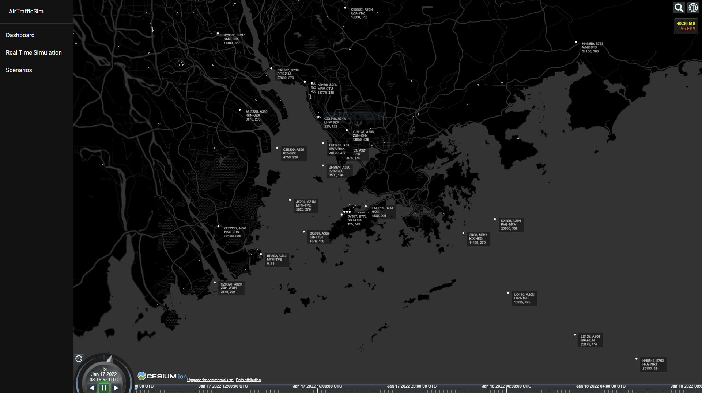
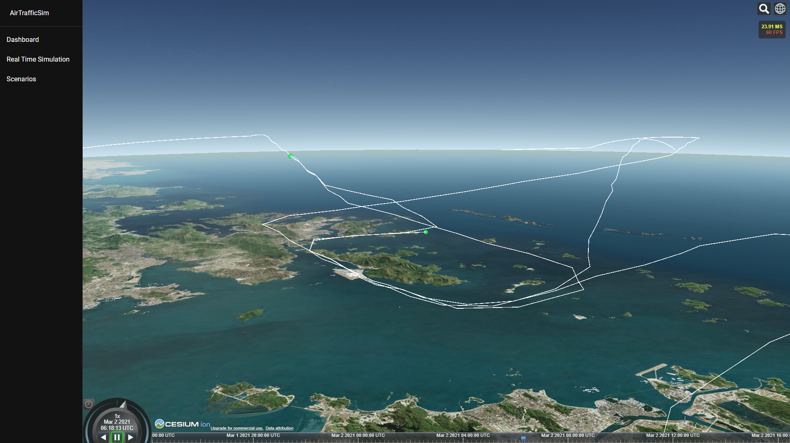

# AirTrafficSim

Air traffic sim is a web-based air traffic simulation and visualization platform. Its goal is to provide a foundation to conduct air traffic management (ATM) research as well as to enable an easy-to-access UI for user to study the result. The platform is still in the early stage of development and many key features are missing. Hence, it is not ready for production use right now.

## Features (preview)

Real time visualization and simulation of air traffic.


Replay simulation scenarios.


## Installation

The final installation procedures is targeted to adopt docker containers for easy installation and deployment. To install for development purpose, please follow the following guide:

### Dependencies:

- npm 8.1.0
- yarn 1.22.17
- node 16.13.0
- python 3.9.7 (suggested to use Conda environment)
- numpy 1.21.2


Other dependencies can be found in the package.json file in client/ and server/ folder respectively.

### Install from Github

```
git clone https://github.com/HKUST-OCTAD-LAB/AirTrafficSim.git
cd AirTrafficSim/

cd client/
yarn install

cd ../server/
npm install
```
After installation, go to client/ folder and create a **.env** file. Insert the Cesium Ion token, which can be extracted from the Cesium Ion portal, in the file as follow.
>REACT_APP_CESIUMION_ACCESS_TOKEN=

### Running web-based UI (for development)

Currently, the client uses port 3000 and the server uses port 5000 for communication. Please open or forward the ports accordingly if needed. To run development environment: 
```
cd client/
yarn start
```
Open a new terminal windows, enter:
```
cd ../server/
npm run dev
```
You should be able to open the UI using any modern browser at http://localhost:3000.

### Running simulation (for development)

To run the simulation, download, unzip, and store BADA data in [simulation/data/BADA](simulation/data/BADA/). Then, at project home directory `/AirTrafficSim`, run `python -m simulation`. This will execute [\_\_main\_\_.py](simulation/__main__.py) and begin the simulation.

## Contribution

AirTrafficSim is under heavy development. To contribute to the simulation, please follow this [python styling guide](https://numpydoc.readthedocs.io/en/latest/format.html#params).

---
## Project structure

```
AirTrafficSim/
├── client/
│   ├── src/
│   │   ├── pages/
│   │   ├── utils/
│   │   └── App.tsx
│   ├── .env
│   ├── .gitignore
│   ├── package.json
│   └── Dockerfile
├── server/
│   ├── src/
│   │   ├── models/
│   │   ├── routes/
│   │   └── database.js
│   ├── server.js
│   ├── .env
│   ├── .gitignore
│   ├── package.json
│   └── Dockerfile
├── simulation/
│   ├── atm/
│   │   └── __init.py
│   ├── data/
│   │   └── BADA/
│   ├── env/
│   │   ├── __init__.py
│   │   └── environment.py
│   ├── traffic/
│   │   ├── __init__.py
│   │   ├── aircraft.py
│   │   ├── performance.py
│   │   ├── traffic.py
│   │   └── weather.py
│   ├── __main__.py
│   └── .gitignore
├──doc/
├── docker-compose.yml
└── Readme.md
```
### client/

The client folder contains the UI of the website. It is written in react.js with [Material UI Library](https://mui.com/). It contains a 3D map using [Cesium.js + Cesium ion](https://cesium.com/) and [Resium](https://resium.reearth.io/).

### server/

The server folder contains the server side program of the website. It is written in [nodejs](https://nodejs.org/en/) using [expressjs](https://expressjs.com/) and [socket.io](https://socket.io/). The platform is targeted to utilize MERN stack (MongoDB, Express JS, React JS and Node JS).
### simulation/

The simulation folder contains the python code for air traffic simulation. It contains 4 folders: [atm/](simulation/atm/), [data/](simulation/data/), [env/](simulation/env/), and [traffic/](simulation/traffic/) as well as [\_\_main\_\_.py](simulation/__main__.py) which is the main entrance of the program.

#### [simulation/atm/](simulation/atm/)

The atm folder contains the simulation code for air traffic management (ATM) and air traffic controller (ATC). This will be the research focus to improve existing ATM strategies and algorithm.

#### [simulation/data/](simulation/data/)

The data folder will contains all the necessary data to conduct the simulation. This includes:
- [x] Aircraft Performance data ([BADA 3.15](https://www.eurocontrol.int/model/bada))
- [ ] Navigation data (can extract VHHH data from [eAIP](https://www.ais.gov.hk/eaip_20211202/2021-12-02-000000/html/index-en-US.html))
- [ ] Weather data

#### [simulation/env/](simulation/env/)

The environment folder contains the simulation setup for study.

#### [simulation/traffic/](simulation/traffic/)

The traffic folder contains the air traffic simulation code. It is targeted to simulate multiple aircrafts' trajectories per timestep efficiently and accurately using BADA performance data as well as simulate aircraft' autopilot and navigation system. 

[traffic.py](simulation/traffic/traffic.py) contains the implementation of the base traffic array which contains all the state variables for all aircraft at one timestamp. 

[aircraft.py](simulation/traffic/aircraft.py) contains the class-like implementation of one individual aircraft. 

[performance.py](simulation/traffic/performance.py) contains the implementation of BADA performance data following BADA user menu. 

[autopilot.py](simulation/traffic/autopilot.py) contains the implementation of aircraft autopilot and flight management system (which includes navigation, flight plan, etc.). 

[weather.py](simulation/traffic/weather.py) contains implementation of weather for each aircraft.

## System architecture

Initial system architecture plan: 


Traffic class diagram
