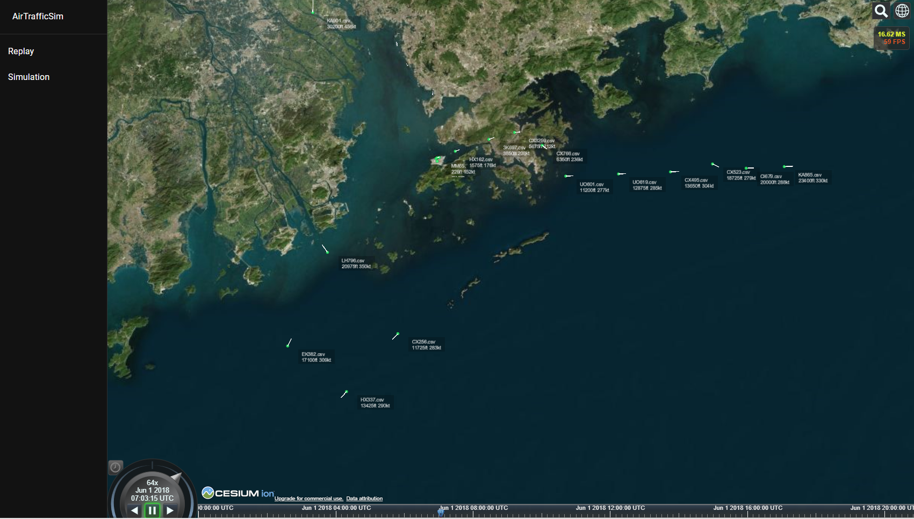

# AirTrafficSim

Air traffic sim is a web-based air traffic simulation and visualization platform. Its goal is to provide a foundation to conduct air traffic management (ATM) research as well as to enable an easy-to-access UI for user to study the result. The platform is still in the early stage of development and many key features are missing. Hence, it is not ready for production use right now.

## Features (preview)

Replay histortic flights given data.



Air traffic simulation using BADA performance data.


## Installation

To install for development purpose, please follow the following guide:

### Dependencies:

- conda (tested with 4.10.3)
  - nodejs (tested with 16.13.0)
  - python (tested with 3.9.7)
  - numpy (tested with 1.21.2)
  - pandas (tested with 1.4.1)


Other nodejs dependencies can be found in the package.json file in client/ and server/ folder respectively.

### Install from Github

```
conda create -n AirTrafficSim python nodejs
conda activate AirTrafficSim

git clone https://github.com/HKUST-OCTAD-LAB/AirTrafficSim.git
cd AirTrafficSim/
python simulation install
```

This will execute the script to install the nodejs dependencies and build the production web enviornment for the UI. The script will ask you to enter the Cesium access token which can be extracted from the [Cesium ion portal](https://cesium.com/platform/cesium-ion/) after signing up a free account.
>REACT_APP_CESIUMION_ACCESS_TOKEN=

Please also download, unzip, and store BADA data in [data/BADA](data/BADA/)

### Running web-based UI (Production)

You can start the production environment by executing the following command. It uses port 5000 for communicaiton. Please open or forward the port accordingly if needed.

```
python simulation run
```

You should be able to open the UI using any modern browser at http://localhost:5000. When you click the tab "Simulation", it will automatically execute the python simulation and feedback the data for visualization in the UI.

### Running web-based UI (Development)

Currently, the client uses port 3000 and the server uses port 5000 for communication. Please open or forward the ports accordingly if needed. To run development environment: 

```
cd AirTrafficSim/client/
yarn start
```

Open a new terminal windows, enter:

```
cd AirTrafficSim/server/
npm run dev
```

You should be able to open the UI using any modern browser at http://localhost:3000.

### Running simulation (Standalone)

To run the simulation as a standalone software, you can execute the following command. 

```
python simulation --headless
```

This will run the simulation without the UI by executing [\_\_main\_\_.py](simulation/__main__.py). The output data will be stored in [data/simulation](data/simulation/) as a CSV file.

## Contribution

AirTrafficSim is under heavy development. To contribute to the simulation, please follow this [python styling guide](https://hackmd.io/@ChrisNguyenAE/By-NM-x6t).

---
## Project structure

```
AirTrafficSim/
├── client/
│   ├── src/
│   │   ├── pages/
│   │   ├── utils/
│   │   └── App.tsx
│   ├── .env
│   ├── .gitignore
│   ├── package.json
│   └── Dockerfile
├── data/
│   ├── BADA/
│   ├── nav/
│   ├── replay/
│   └── simulation/
├── .gitignore
├── server/
│   ├── src/
│   │   ├── models/
│   │   ├── routes/
│   │   └── database.js
│   ├── server.js
│   ├── .env
│   ├── .gitignore
│   ├── package.json
│   └── Dockerfile
├── simulation/
│   ├── atm/
│   │   └── __init.py
│   ├── env/
│   │   ├── __init__.py
│   │   └── environment.py
│   ├── traffic/
│   │   ├── __init__.py
│   │   ├── aircraft.py
│   │   ├── performance.py
│   │   ├── traffic.py
│   │   └── weather.py
│   ├── __main__.py
│   └── .gitignore
├──doc/
├── docker-compose.yml
└── Readme.md
```
### client/

The client folder contains the UI of the website. It is written in react.js with [Material UI Library](https://mui.com/). It contains a 3D map using [Cesium.js + Cesium ion](https://cesium.com/) and [Resium](https://resium.reearth.io/).

### data/

The data folder contrains all the data needed for simulation which includes BADA data (user would need to provide their own data due to license requirement), navigation data, replay (input) and simulation (output) data.

- [x] Aircraft Performance data (Not included but obtainable at [eurocontrol](https://www.eurocontrol.int/model/bada) website.)
- [x] Navigation data at [xplane_default_data.zip](data/nav/xplane_default_data.zip) using [Xplane-11 data](https://developer.x-plane.com/docs/data-development-documentation/) under the terms of the Free Software Foundation General Public License (GPL).
- [ ] Weather data

### server/

The server folder contains the server side program of the website. It is written in [nodejs](https://nodejs.org/en/) using [expressjs](https://expressjs.com/) and [socket.io](https://socket.io/). The platform is targeted to utilize MERN stack (MongoDB, Express JS, React JS and Node JS).
### simulation/

The simulation folder contains the python code for air traffic simulation. It contains 4 folders: [atm/](simulation/atm/), [data/](simulation/data/), [env/](simulation/env/), and [traffic/](simulation/traffic/) as well as [\_\_main\_\_.py](simulation/__main__.py) which is the main entrance of the program.

#### [simulation/atm/](simulation/atm/)

The atm folder contains the simulation code for air traffic management (ATM) and air traffic controller (ATC). This will be the research focus to improve existing ATM strategies and algorithm.

#### [simulation/env/](simulation/env/)

The environment folder contains the simulation setup for study.

#### [simulation/traffic/](simulation/traffic/)

The traffic folder contains the air traffic simulation code. It is targeted to simulate multiple aircrafts' trajectories per timestep efficiently and accurately using BADA performance data as well as simulate aircraft' autopilot and navigation system. 

[traffic.py](simulation/traffic/traffic.py) contains the implementation of the base traffic array which contains all the state variables for all aircraft at one timestamp. 

[aircraft.py](simulation/traffic/aircraft.py) contains the class-like implementation of one individual aircraft. 

[performance.py](simulation/traffic/performance.py) contains the implementation of BADA performance data following BADA user menu. 

[autopilot.py](simulation/traffic/autopilot.py) contains the implementation of aircraft autopilot and flight management system (which includes navigation, flight plan, etc.). 

[weather.py](simulation/traffic/weather.py) contains implementation of weather for each aircraft.

## System architecture

Initial system architecture plan:


Traffic class diagram


