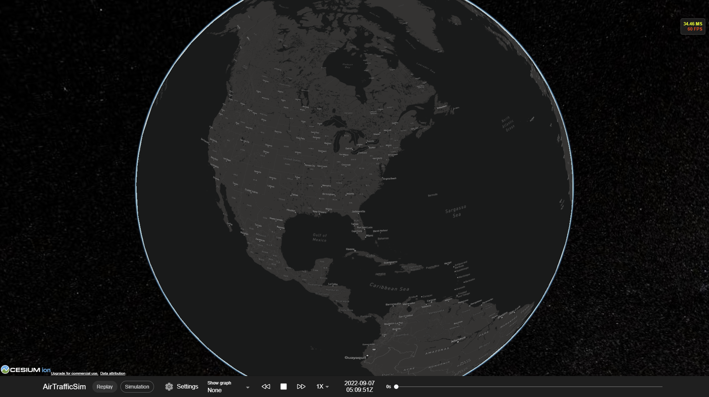

# AirTrafficSim

AirTrafficSim is a web-based air traffic simulation software written in Python and javascript. It is designed to visualize historic and research data, perform microscopic studies of air traffic movement with the integration of a historic weather database, and evaluate the performance of ATM algorithms.

## Features

- Replay histortic flights given data (FlightRadar 24 and simulated flights)
- Air traffic simulation using [BADA performance data](https://www.eurocontrol.int/model/bada) and OpenAP (WIP)
- Navigation data simulation and visualization from [x-plane 11](https://developer.x-plane.com/docs/data-development-documentation/)
- Autopilot and Flight Management System simulation
- Holding, vectoring, direct to maneuvers simulated
- Weather data from [ECMWF ERA5](https://cds.climate.copernicus.eu/cdsapp#!/dataset/reanalysis-era5-pressure-levels?tab=overview) and custom radar image
- Air traffic is controlled with API interface to simulate ATC interaction




```{toctree}
   :hidden:
   
   Installation <install>
   Getting started <start>
```

```{toctree}
   :caption: Tutorial
   :hidden:
   
   Project structure <tutorial/structure>
   Creating simulation environment <tutorial/env>
   Converting historic data <tutorial/historic>
```

```{toctree}
   :caption: Development
   :hidden:
   
   Client <development/client>
   Documentation <development/doc>
   API reference <api/index>
```