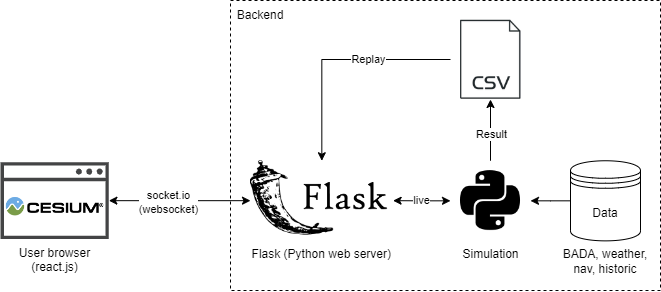
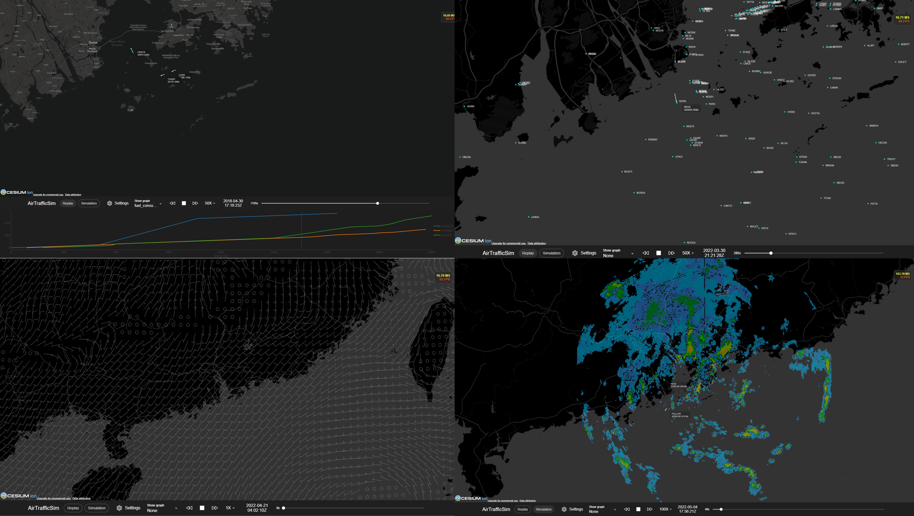

# Statement of need

Air traffic management (ATM) research traditionally focuses on the macroscopic aspect of air transportation such as airspace design research, traffic flow management, airport planning and scheduling, and more [@ATM]. Recently, as new aerial vehicles concepts, including urban air mobility (UAM) and unmanned aircraft system (UAS) or drones, are being developed, there has been a growing interest in performing microscopic ATM research, for example, conflict resolution using reinforcement learning [@Conflict], 4D-trajectory optimization [@4D], and even unmanned traffic management (UTM) development. Eurocontrol U-space [@uspace] and FAA/NASA UTM project [@nasa] are some of the examples that the industry are focusing more on such research. 

To facilitate microscopic ATM research, an agent-based simulation and visualization software is needed. However, most ATM simulation tools are commercial products aimed at training air traffic controllers. ATM simulation tools for research purposes that are easily accessible and open-source, such as Bluesky [@BlueSky], are still scarce. Therefore, AirTrafficSim was developed to assist researchers to perform ATM research with an easy-to-use and comprehensive software environment to simulate air traffic movement and visualize the result. It is an open-source package that welcomes everyone to access and contribute.

# Summary

AirTrafficSim is a web-based air traffic simulation software written in python and javascript. It is designed to visualize ATM research results, perform microscopic studies of air traffic movement, analyze and convert historic data, and to evaluate the performance of ATM algorithms. \autoref{fig:Architecture} shows the architecture of AirTrafficSim.

{ width=75% }

AirTrafficSim contains a web-based frontend written in javascript with Ionic React framework to provide an easy-to-use user interface to visualize both historic and simulated air traffic and other data in a browser. The 3D globes are powered by the CesiumJS library to stream high-resolution maps, terrain, and 3D building data, which also provides a rich API library to visualize dynamic geospatial data from the simulation. The UI can also plot aircraft parameters using the Plotly.js library. On the other hand, the backend of AirTrafficSim consists of a Flask python server to communicate with the UI using websocket protocol. It also consists several simulation modules which are navigation, weather, autopilot, performance, and flight route detection, which will be explained in the following.

The navigation module provides global airports, waypoints, navigation aids and fixes, airways, Standard Instrument Departures (SIDs), Standard Terminal Arrival Routes (STARs), and approach procedures information using the navigation database from x-plane 11 [@xplane11]. 

The weather module provides historic weather information including multi-level wind, pressure, temperature, and single-level surface precipitation data from the ECMWF ERA5 weather database [@era5]. It also processes radar images provided by users as a source of high-resolution convective weather information.

The autopilot module processes the assigned flight plan and control the aircraft to follow the plan from take-off to landing in a full flight simulation. It can also control the aircraft based on the target state (ATC command) inputted by the user and algorithm. Non-standard manoeuvres that are sometimes used by air traffic controllers such as vectoring and holding can also be commanded.

The performance module calculates the aircraft state, such as speed, heading, vertical rate, and fuel consumption, for each timestep. Currently, `AirtrafficSim` makes use of the licensed BADA performance model data from Eurocontrol [@bada] but it is extensible to other performance models such as the open-source OpenMP model [@openap].

The flight route detection module detects the flight route including origin and destination airports, SIDs, and STARs from historic flight data and generates a complete flight plan for simulation. A robust algorithm is being developed to detect the airways to generate a complete flight plan.

{ width=100% }

AirTrafficSim can be applied flexibility for different ATM research settings. One of the recent works is to simulate and validate the solutions to arrival sequencing problems in the Hong Kong International Airport by applying mixed-integer linear programming algorithm [@hkia]. The software can also be used to tackle conflict resolution problems, route coordination and optimization problems, contingency management problems, and more.

# Acknowledgements

This project was supported by the Hong Kong Innovation and Technology Commission (Project No. ITS/016/20).

# References