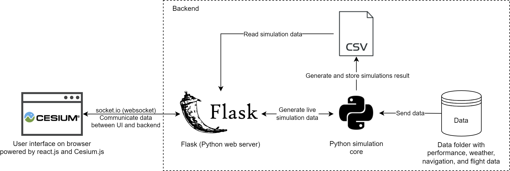

# Statement of need

Air traffic management (ATM) research traditionally focuses on the macroscopic aspect of air transportation such as airspace design, traffic flow management, airport planning and scheduling, and more [@ATM]. Recently, with the new development of aerial vehicle concepts, including urban air mobility (UAM) and unmanned aircraft system (UAS), there has been a growing interest in performing microscopic ATM research, for example, conflict resolution using reinforcement learning [@Conflict], 4D-trajectory optimization [@4D], and even unmanned traffic management (UTM). Eurocontrol U-space [@uspace] and FAA/NASA UTM project [@nasa] are some examples of existing efforts in industry to perform such research. 

To facilitate microscopic ATM research, an agent-based simulation and visualization software is needed. However, most ATM simulation tools are commercial products aimed at training air traffic controllers and airspace planning. ATM simulation tools for research purposes that are easily accessible and open-source, such as BlueSky [@BlueSky], are still scarce. Therefore, we developed AirTrafficSim to assist researchers to perform ATM research with an easy-to-use and comprehensive software environment to simulate air traffic movement and visualize the results. It is an open-source package that welcomes everyone to access and contribute.

# Summary

AirTrafficSim is a web-based air traffic simulation software written in Python and JavaScript. It is designed to visualize historical and research data, perform microscopic studies of air traffic movement with the integration of a weather database, and evaluate the performance of ATM algorithms. \autoref{fig:Architecture} shows the architecture of AirTrafficSim.

{ width=75% }

AirTrafficSim contains a web-based frontend written in JavaScript using the Ionic React framework to provide an easy-to-use user interface (UI) to visualize both historical and simulated air traffic and other data in a browser. The 3D modeling of the globe is supported by the CesiumJS library to stream high-resolution maps, terrains, and 3D building data. The library also provides a rich API to visualize dynamic geospatial data obtained from performing simulations. The UI can also plot aircraft parameters using the Plotly.js library. 

Meanwhile, the backend of AirTrafficSim has a Python web server using the Flask framework to communicate with the UI using the WebSocket protocol. It also contains several modules, namely navigation, weather, autopilot, performance, and flight route detection, to simulate flight trajectories. The details of each module will be explained briefly below. \autoref{fig:UI} showcases some of the key features of AirTrafficSim UI.

{ width=100% }

The navigation module provides global airports, waypoints, navigation aids and fixes, airways, Standard Instrument Departures (SIDs), Standard Terminal Arrival Routes (STARs), and approach procedure information using the navigation database from X-Plane 11 [@xplane11]. 

The weather module provides weather information including multi-level wind, pressure, temperature, and single-level surface precipitation data from the ECMWF ERA5 weather database [@era5]. It also processes radar images provided by users as a source of high-resolution convective weather information.

The autopilot module processes the assigned flight plan and controls the aircraft to follow the plan from take-off to landing. It can also control the aircraft based on the target state inputted by the user and algorithm to simulate ATC commands. Non-standard maneuvers that are sometimes used by air traffic controllers such as vectoring and holding can also be commanded.

The performance module calculates the aircraft state, such as speed, heading, vertical rate, and fuel consumption, for each timestep. Currently, AirtrafficSim makes use of the licensed BADA performance model data from Eurocontrol [@bada] but it is extensible to other performance models such as the open-source OpenMP model [@openap].

The flight route detection module detects the flight route including origin and destination airports, SIDs, and STARs from historical flight data and generates a flight plan for simulation. A robust algorithm is being developed to detect the airways to generate a complete flight plan.

AirTrafficSim can be applied flexibly for different ATM research settings. One of the recent works is to simulate and validate the solutions to an arrival sequencing problem in the Hong Kong International Airport by applying a mixed-integer linear programming algorithm [@hkia]. The software can also be used to tackle conflict resolution problems, route coordination and optimization problems, contingency management problems, and more.

# Acknowledgements

This project was supported by the Hong Kong Innovation and Technology Commission (Project No. ITS/016/20).

# References